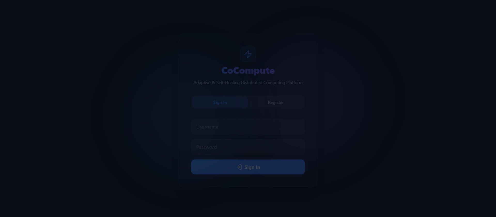
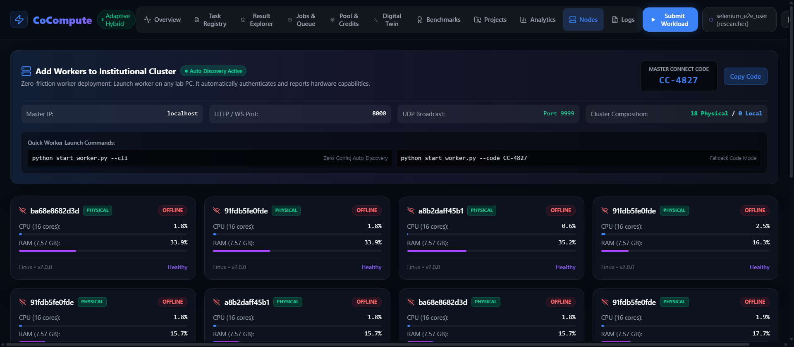
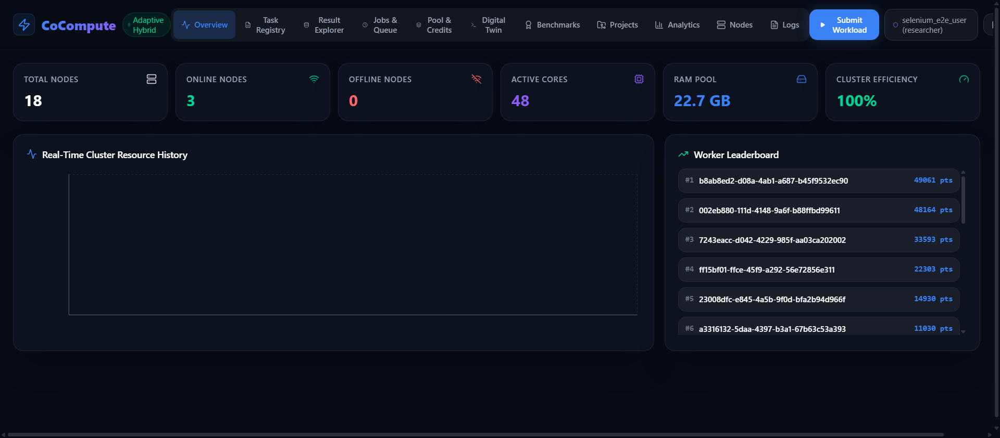
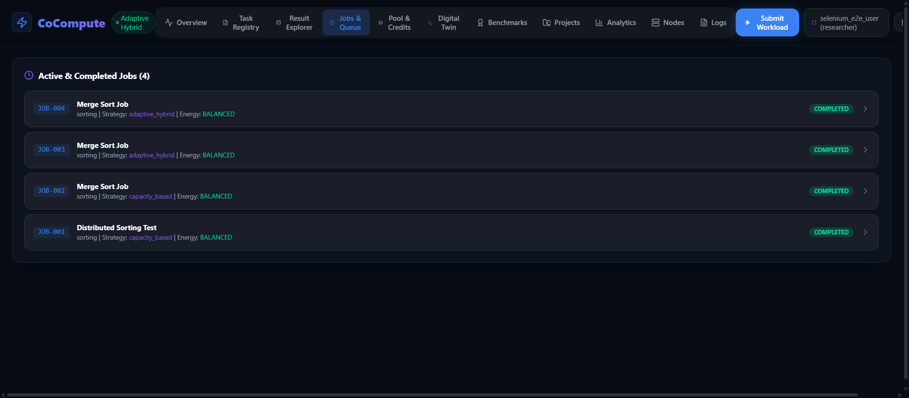
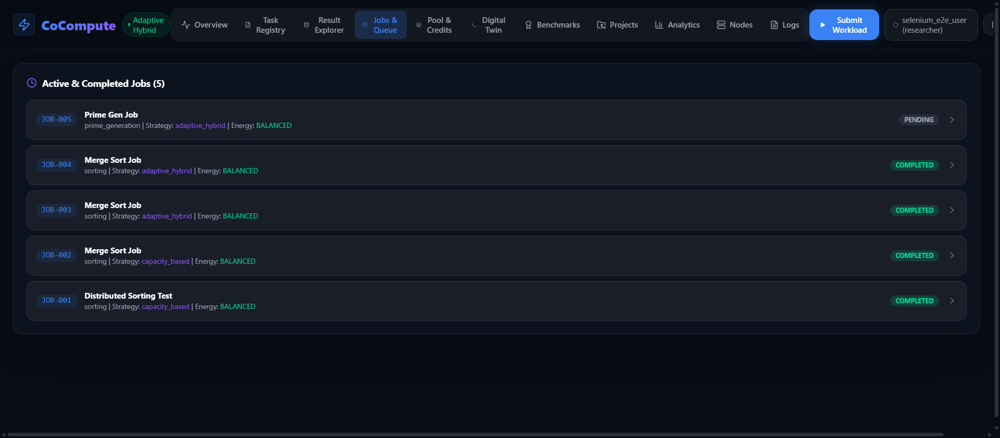
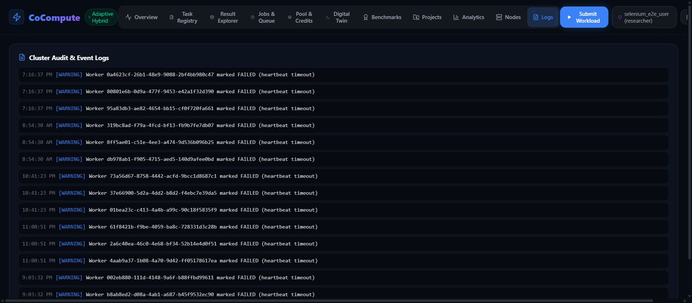
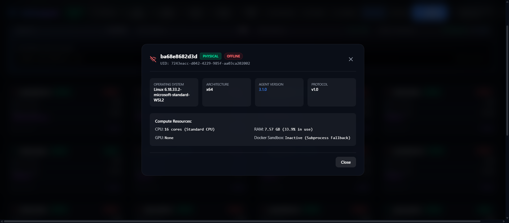
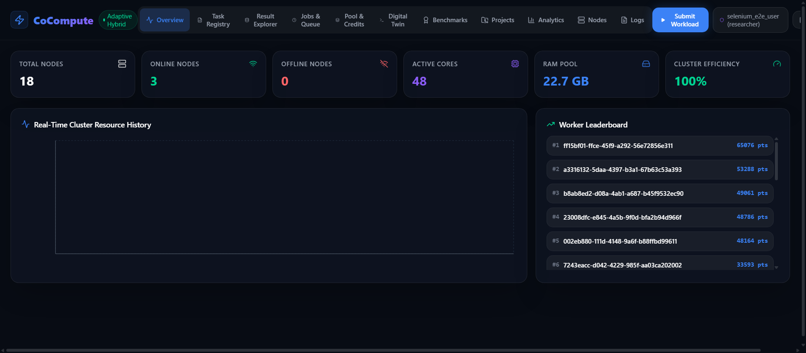

# CoCompute — Selenium E2E Test Report

**Date:** 2026-10-07 19:28:22  
**Platform:** Single-PC Local Cluster  
**Dashboard:** http://localhost:5173  
**Master API:** http://localhost:8000/api/v1  

---

## Summary

| Metric | Value |
|--------|-------|
| Total Tests | 16 |
| ✅ Passed | 16 |
| ❌ Failed | 0 |
| ⚠️ Skipped | 0 |
| Duration | 91.99s |
| Pass Rate | 100.0% |

---

## Detailed Results

| # | Test | Status | Duration | Detail |
|---|------|--------|----------|--------|
| 1 | API Health Check | ✅ PASS | 0.03s | 18 workers registered, 3 online |
| 2 | Browser Setup | ✅ PASS | 0s | Browser initialized: chrome |
| 3 | Dashboard Reachable | ✅ PASS | 0.35s | Title: dashboard |
| 4 | Auth Register/Login | ✅ PASS | 9.92s | Successfully authenticated |
| 5 | Overview Stats Display | ✅ PASS | 2.26s | Found labels: ['Total Nodes', 'Online Nodes', 'Active Cores'] |
| 6 | Worker Nodes Visible | ✅ PASS | 2.61s | Online workers visible in Nodes tab |
| 7 | WebSocket Telemetry | ✅ PASS | 2.22s | Real-time WebSocket connection active (Adaptive Hybrid mode) |
| 8 | Submit Sorting Job | ✅ PASS | 7.09s | Sorting job submitted via dashboard modal |
| 9 | Job Execution Wait | ✅ PASS | 0.14s | Job 'Merge Sort Job' completed in 0s |
| 10 | Jobs Tab Display | ✅ PASS | 2.55s | Job entries visible in Jobs & Queue tab |
| 11 | Job Result Verification | ✅ PASS | 0.02s | Job completed with result keys: ['sorted_preview', 'total_elements', 'min_value' |
| 12 | Submit & Execute Prime Job | ✅ PASS | 13.88s | Prime job completed in 0s |
| 13 | Navigate All Tabs | ✅ PASS | 21.18s | Visited 8/8 tabs: ['Overview', 'Task Registry', 'Result Explorer', 'Jobs', 'Pool |
| 14 | Worker Detail Modal | ✅ PASS | 10.6s | Worker detail modal opened with hardware specs |
| 15 | API Provenance Check | ✅ PASS | 0.08s | Provenance retrieved: 5 chunks with attempt trees |
| 16 | Final Dashboard State | ✅ PASS | 13.76s | Dashboard final state captured successfully |

---

## Screenshots

### Dashboard Reachable


### Auth Register/Login


### Overview Stats Display


### Worker Nodes Visible


### WebSocket Telemetry


### Submit Sorting Job


### Job Execution Wait


### Jobs Tab Display


### Submit & Execute Prime Job


### Navigate All Tabs


### Worker Detail Modal


### Final Dashboard State


---

## Test Architecture

```
Single-PC Test Topology:
  ┌─────────────┐    ┌──────────────┐    ┌────────────────┐
  │ Master Node │◄──►│  Worker (1)   │    │ Selenium       │
  │  :8000      │    │  localhost     │    │ Browser Driver │
  └──────┬──────┘    └──────────────┘    └───────┬────────┘
         │                                       │
         ▼                                       ▼
  ┌─────────────┐                       ┌───────────────┐
  │ Dashboard   │◄──────────────────────│ Test Assertions│
  │  :5173      │   (HTTP + WebSocket)  │ & Screenshots  │
  └─────────────┘                       └───────────────┘
```

**Overall Verdict: 🟢 ALL TESTS PASSED**
